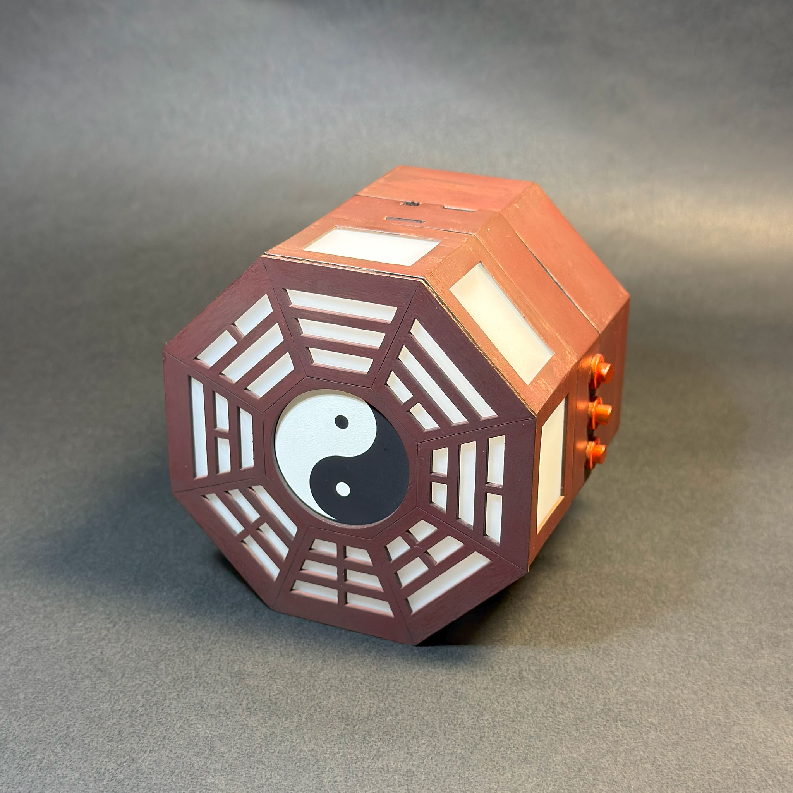
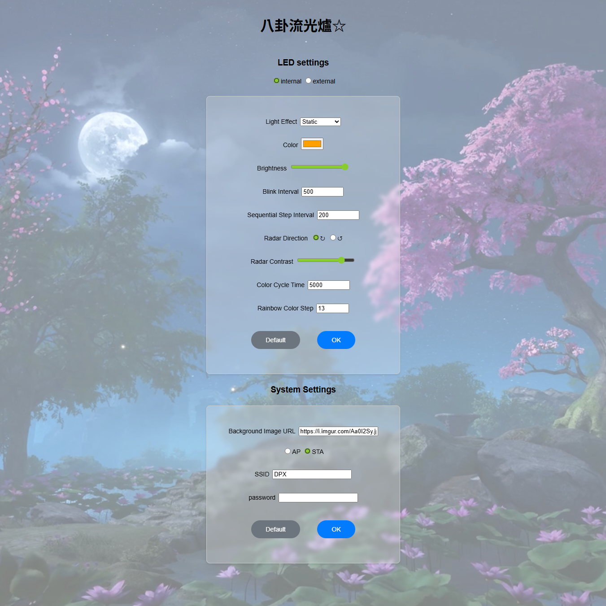
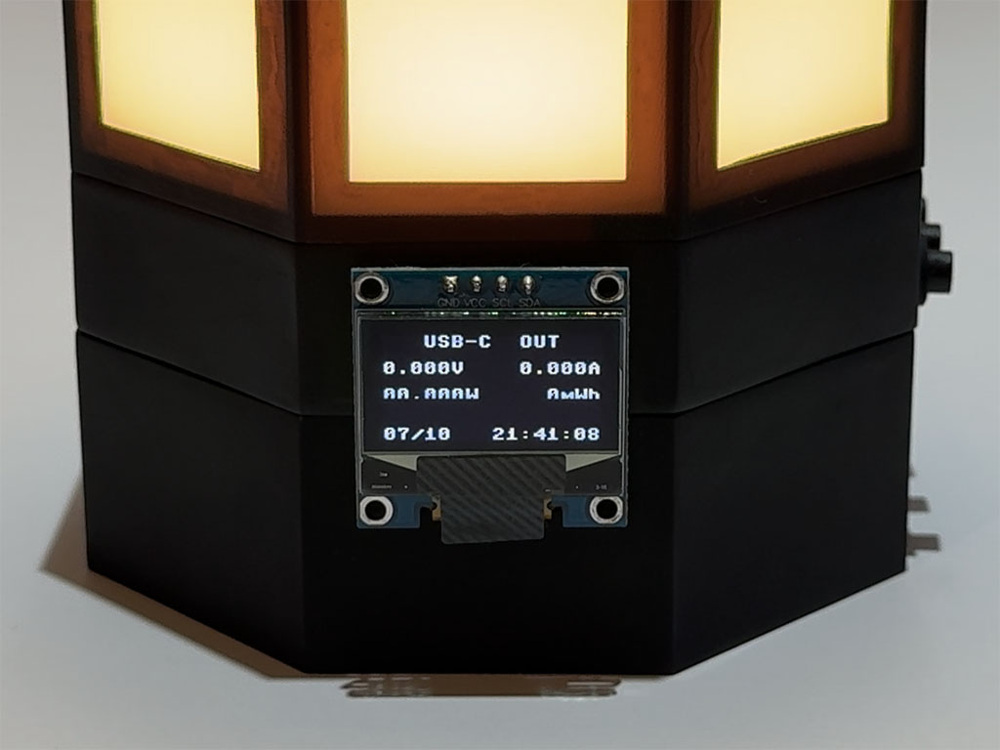

# 八卦流光爐☆
這是個主要當彩燈使用的開源八卦爐專案DA☆ZE  
仿照 東方Project 霧雨魔理沙 的道具八卦爐外型製作  
<table>
<tr><td align="center" colspan="2"> </td></tr>
<tr><td align="center"> </td><td align="center"> </td></tr>
<tr><td align="center"> </td><td align="center"> </td></tr>
<tr><td align="center" colspan="2"> </td></tr>
</table> 

## 功能介紹
- 自帶網頁+實體按鍵控制燈效
- 單USB-C孔之行動電源
- 顯示各項資訊的小螢幕
- 可外接電腦用之ARGB燈條
- 可選配藍牙喇叭模組
- OCP、OVP、OTP、ESD防護（未經任何標準檢驗）
- 有興趣也可自行修改成自己的版本
 

按鍵功能（按鍵面向自己時由左往右數）：  
- 按鍵1為燈控按鍵，短按一下調顏色、短按兩下調燈效模式、長按調燈光亮度
- 按鍵2為操控螢幕，短按切換畫面，長按開關螢幕
- 開機同時按住按鍵1、2一秒，可將整台裝置恢復預設值
- 按鍵3為行動電源按鍵，按一下開啟電源輸出，按兩下關閉輸出
 

螢幕顯示模式：  
- 充放電相關資訊、網路時鐘
- 充放電功率
- BadApple動畫
- 系統資訊

不安裝螢幕也可運作，請在關機狀態下插拔螢幕 
 
網頁控制功能，連線到此裝置的Wi-Fi後，在瀏覽器輸入小螢幕上的IP位址，即可進入控制頁面： 
預設SSID為「BaGuaLu」，密碼為「bagualu123」，IP為「192.168.4.1」 

 
AP模式為裝置自成Wi-Fi基地台（預設值），STA則為連線至別的Wi-Fi 
設置完成後需要手動重新開機 
 
若設定連線到其他Wi-Fi，成功連上網際網路後，螢幕狀態顯示畫面最下面一欄會變為網路時鐘 
時區暫不能修改，固定為UTC+8 

 
 

其餘事項
- 行動電源最高5V⎓3A輸出、2.4A輸入（實測2.6A），容量根據安裝的18650電池而定，若選擇製作教學中的型號，額定容量為6600mAh，實際容量會稍高一點
- 輸入電流大於4A時會啟動保護機制，無法充電，請排除狀況後重開機解除
- 當以接近最大功率充放電時，因過溫度保護機制設計的較敏感，會暫時降低功率，或直接關斷一段時間，直到溫度降低
- 裝置無法正常啟動、韌體更新完成時，請按照上方的方法重設裝置

## 展示短片

## 製作&組裝教學
本專案提供製作教學，若想瞭解技術細節，或實際上手製作，歡迎至<a href="https://github.com/DeePingXian/BaGuaLiuGuangLu/wiki">Wiki頁面</a>查看

## 製作人員
- 結構設計：<a href="https://thwiki.cc/%E6%B1%82%E9%97%BB%E5%B7%A5%E5%9D%8A">求聞工坊</a>
- 電路設計：<a href="https://www.facebook.com/DeePingXian">地平線 DeePingXian</a>
- 控制程式：<a href="https://www.facebook.com/DeePingXian">地平線 DeePingXian</a>
- 外殼模型：<a href="https://thwiki.cc/%E6%B1%82%E9%97%BB%E5%B7%A5%E5%9D%8A">求聞工坊</a>
- 外殼塗裝：<a href="https://www.facebook.com/j.kagamitsuki/posts/pfbid0qQWvzFg5CoFkT7tkbtXfqWopT1fieFPE1NWJFECgEJuv1Gb7SHNib1UmLF8mmVCvl">JKX鏡月</a>