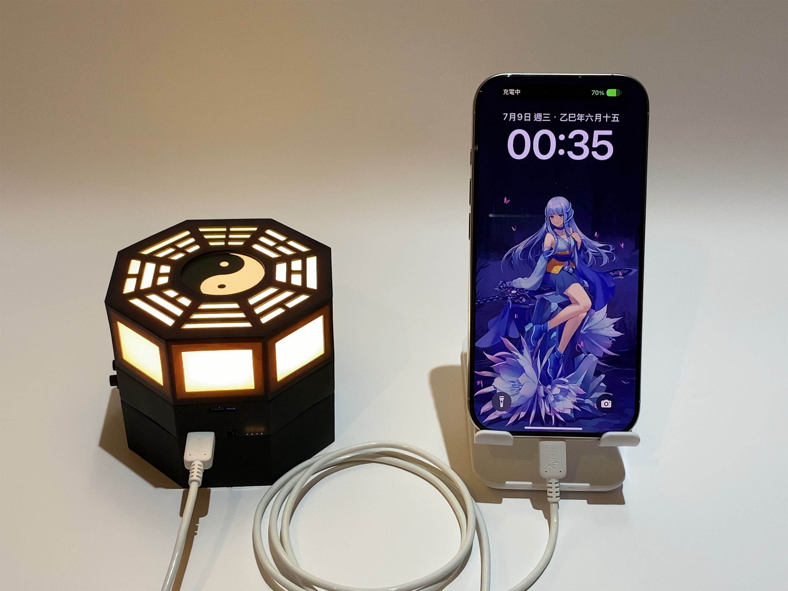

# 八卦流光爐☆
這是個開源的八卦爐DA☆ZE  
<table>
<tr><td align="center"> </td><td align="center">（待補） </td></tr>
<tr><td align="center"> </td><td align="center"> </td></tr>
<tr><td align="center" colspan="2"> </td></tr>
</table> 

## 功能介紹
- 可自行修改之開源程式、電路板
- 自帶網頁+實體按鍵控制燈效
- USB Type-C孔最高5V3A輸出、2.4A輸入
- OLED小螢幕可顯示充電功率、狀態、BadApple動畫、網路時鐘
- 可外接電腦用之ARGB燈條
- 預留安裝藍芽喇叭模組位置
- OCP、OVP、OTP、ESD防護（未送任何標準檢驗）
 

按鍵功能（按鍵面向自己時由左往右數）：  
- 按鍵1為燈控按鍵，短按一下調顏色、短按兩下調燈效模式、長按調燈光亮度
- 按鍵2設計為操控螢幕，短按切換畫面，長按開關螢幕
- 開機同時按住按鍵1、2一秒，可恢復出廠設定值，韌體更新、無法開機時請照此方法重設
- 按鍵3為行動電源按鍵，按一下開啟電源輸出，按兩下關閉輸出
 

螢幕顯示模式：  
- 電源相關、網路時鐘
- 充放電功率
- BadApple動畫
- 連網資訊

不安裝螢幕也可運作，請在關機狀態下插拔螢幕 
 
網頁控制功能，連線到此裝置的Wi-Fi後，在瀏覽器輸入螢幕上的IP位址，即可進入控制頁面： 

 
AP為裝置自成Wi-Fi基地台（預設值），STA則為連線至別的Wi-Fi 
設置完成後需要手動重新開機 
 
預設SSID為「BaGuaLu」，密碼為「bagualu123」 
若設定連線到其他Wi-Fi，成功連上網際網路後，螢幕狀態顯示畫面最下面一欄會變為網路時鐘 

 
 

## 展示影片
（待補）

## 製造&組裝教學
本專案提供製造教學，請至<a href="https://github.com/DeePingXian/BaGuaLiuGuangLu/wiki">Wiki頁面</a>查看

## 製作人員
- 結構設計：<a href="https://thwiki.cc/%E6%B1%82%E9%97%BB%E5%B7%A5%E5%9D%8A">求聞工坊</a>
- 電路設計：地平線 DeePingXian
- 控制程式：地平線 DeePingXian
- 外殼模型：<a href="https://thwiki.cc/%E6%B1%82%E9%97%BB%E5%B7%A5%E5%9D%8A">求聞工坊</a>
- 展示品外殼塗裝：